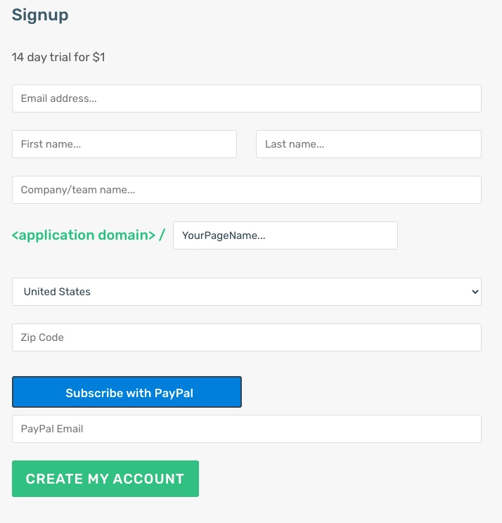

# DigitalGifts

## Context

www.alt.bike is een speciaalzaak voor high end racefietsen. Ze willen graag klanten de mogelijkheid geven om digitale cadeaucheques to kopen. 

DigitalGifts biedt deze service aan aan handelszaken als alt.bike. Een button op alt.bike's website verwijst door naar alt.bike's pagina (\<digitalgifts domain\>/altbike).

## Werkwijze

### 1. Aanmaken account op digitalgifts.

De alt.bike's shopverantwoordelijke maakt een account aan op DigitalGifts.

De service heeft een vaste kostprijs van €15 per maand. 

Hiervoor wordt bij het aanmelden een automatisch betaling opgezet bij PayPall (Paypal Subscription Button)

### 2. client profile.

alt.bike's shopverantwoordelijke gaat dan aan de slag het de altbike account in te stellen.

 Hij geeft aan welke giftvouchers te koop worden aangeboden (prijs en geldigheidsduur), en geeft aan welke betalingsmogelijkheden actief zijn (PayPall, Mollie...).

### 3. Werkwijze

1. De klant die een gift voucher will schenken klikt op de "*gift Voucher*" button op alt.bike's website en word doorverwezen naar de alt.bike's pagina op \<digitalgifts domain\>/altbike.

2. De klant koopt de gift voucher ( zie https://www.juicyjoessteakhouse.com/gift-cards voor voorbeeld).

3. Een bevestigingsmail wordt gestuurd naar de klant.

4. De gift voucher wordt per mail verstuurd naar de uiteindelijke ontvanger.

5. De gift voucher bevat een unieke QR code.

### 4. Ontwaarden.

1. Wanneer de gift voucher (= QR code) aangeboden wordt in de alt.bike bikeshop opent de verantwoordelijke zijn account op www.gifts.digital en kiest voor "ontwaarden". Hij scant de QR code.

2. Er wordt gecheckt of deze QR code idd overeenkomt met een uitgegeven QR code en indien correct krijgt de shopverantwoordelijke de mogelijkheid om te ontwaarden.

### 6. opmerkingen

- Integreer in eerste instatie enkel Paypall betalingen (https://handyopinion.com/integrating-paypal-with-spring-boot-application/). Per Digitalgifts klant wordt een ander Paypall account gebruikt. (in dit geval het Paypall Account van Alt.Bike).

- Integreer Elastic SMTP relay (https://elasticemail.com/) als email sender (een account wordt voorzien)

